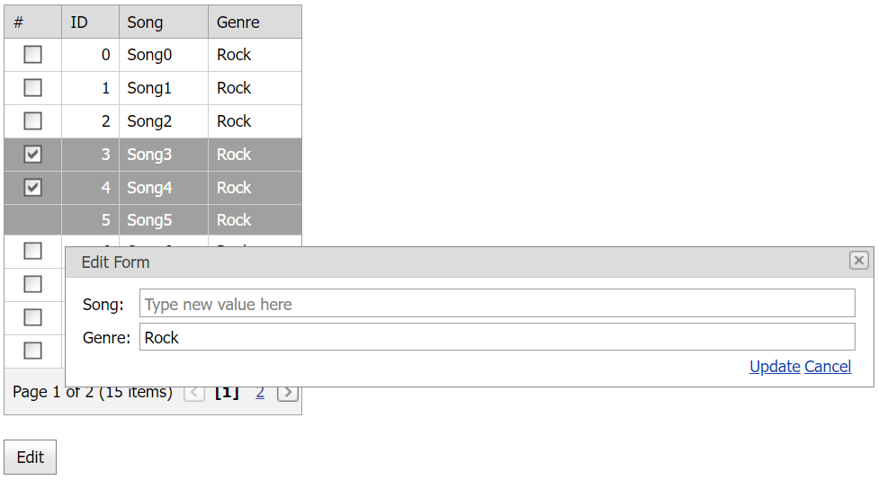

<!-- default badges list -->

[](https://supportcenter.devexpress.com/ticket/details/E2026)
[](https://docs.devexpress.com/GeneralInformation/403183)
<!-- default badges end -->
# Grid View for ASP.NET Web Forms - How to edit multiple selected rows in a single edit form
<!-- run online -->
**[[Run Online]](https://codecentral.devexpress.com/e2026/)**
<!-- run online end -->

This example demonstrates how to configure the grid's cell edit functionality to allow a user to edit multiple selected rows in a single edit form.



## Overview

Create the [Grid View](https://docs.devexpress.com/AspNet/DevExpress.Web.ASPxGridView) control and add a button to the page. Handle the button's client-side `Click` event and do the following in the handler:

* Call the grid's [GetSelectedRowCount](https://docs.devexpress.com/AspNet/js-ASPxClientGridView.GetSelectedRowCount) method to determine whether any grid rows are selected.
* Call the grid's `PerformCallback` method to send a callback to the server with a custom parameter (**StartEditing**).

```aspx
<dx:ASPxGridView id="ASPxGridView1" runat="server" AutoGenerateColumns="False" ClientInstanceName="grid" KeyFieldName="ID" OnCellEditorInitialize="ASPxGridView1_CellEditorInitialize" OnCustomCallback="ASPxGridView1_CustomCallback" OnRowUpdating="ASPxGridView1_RowUpdating" OnStartRowEditing="ASPxGridView1_StartRowEditing">
    <Columns>
        <dx:GridViewCommandColumn ShowSelectCheckbox="True" VisibleIndex="0" />
        <!-- ... -->
    </Columns>
    <SettingsEditing Mode="PopupEditForm" EditFormColumnCount="1" PopupEditFormModal="True" ... />
</dx:ASPxGridView>

<dx:ASPxButton ID="ASPxButton1" runat="server" AutoPostBack="False" Text="Edit">
    <ClientSideEvents Click="function(s, e) {
        if(grid.GetSelectedRowCount() == 0) alert('No grid row is selected.');
        else grid.PerformCallback('StartEditing');
    }" />
</dx:ASPxButton>
```

Handle the grid's server-side [CustomCallback](https://docs.devexpress.com/AspNet/DevExpress.Web.ASPxGridView.CustomCallback) event. In the handler, define the last selected row and use the row's visible index to start editing.

```cs
protected void ASPxGridView1_CustomCallback(object sender, DevExpress.Web.ASPxGridViewCustomCallbackEventArgs e){
    ASPxGridView grid = sender as ASPxGridView;
    if (e.Parameters == "StartEditing"){
        object lastSelectedRowKeyValue = grid.GetSelectedFieldValues("ID")[grid.Selection.Count - 1];
        int lastSelectedRowVisibleIndex = grid.FindVisibleIndexByKeyValue(lastSelectedRowKeyValue);
        grid.StartEdit(lastSelectedRowVisibleIndex);
    }
}
```

Handle the grid's server-side [CellEditorInitialize](https://docs.devexpress.com/AspNet/DevExpress.Web.ASPxGridView.CellEditorInitialize) event. In the handler, determine whether the edit value is common for all rows within the specified column. Based on a result, assign a new value to the editor.

```cs
protected void ASPxGridView1_CellEditorInitialize(object sender, DevExpress.Web.ASPxGridViewEditorEventArgs e){
    ASPxGridView grid = sender as ASPxGridView;
    if (!(grid.IsEditing && isEditing)) return;
    if (grid.Selection.Count == 1 || e.Column.ReadOnly) return;
    e.Editor.Value = IsCommonValueForAllSelectedRows(e.Column, e.Value) ? e.Value : null;
}

private bool IsCommonValueForAllSelectedRows(DevExpress.Web.GridViewDataColumn column, object value){
    bool res = true;
    List<object> selectedRowValues = ASPxGridView1.GetSelectedFieldValues(column.FieldName);
    for (int i = 0; i < selectedRowValues.Count; i++){
        if (selectedRowValues[i].ToString() != value.ToString()){
            res = false;
            break;
        }
    }
    return res;
}
```

To update grid data based on new edit values, handle the grid's server-side [RowUpdating](https://docs.devexpress.com/AspNet/DevExpress.Web.ASPxGridView.RowUpdating) event. In the handler, use the [newValues](https://docs.devexpress.com/AspNet/DevExpress.Web.Data.ASPxDataUpdatingEventArgs.NewValues) argument property to assign new values to modified cells or restore initial values.

```cs
protected void ASPxGridView1_RowUpdating(object sender, DevExpress.Web.Data.ASPxDataUpdatingEventArgs e){
    DataTable dt = Session["GridDataSource"] as DataTable;

    if (ASPxGridView1.Selection.Count == 1){
        DataRow row = dt.Rows.Find(e.Keys["ID"]) as DataRow;
        row["Song"] = e.NewValues["Song"];
        row["Genre"] = e.NewValues["Genre"];
    }
    if (ASPxGridView1.Selection.Count > 1){
        List<object> selectedRowKeys = ASPxGridView1.GetSelectedFieldValues("ID");
        for (int i = 0; i < selectedRowKeys.Count; i++){
            DataRow row = dt.Rows.Find(selectedRowKeys[i]) as DataRow;
            row["Song"] = (e.NewValues["Song"] == null) ? row["Song"] : e.NewValues["Song"];
            row["Genre"] = (e.NewValues["Genre"] == null) ? row["Genre"] : e.NewValues["Genre"];
            continue;
        }
    }
    dt.AcceptChanges();
    Session["GridDataSource"] = dt;
    // ...
}
```

## Files to Review

* [Default.aspx](./CS/WebSite/Default.aspx) (VB: [Default.aspx](./VB/WebSite/Default.aspx))
* [Default.aspx.cs](./CS/WebSite/Default.aspx.cs) (VB: [Default.aspx.vb](./VB/WebSite/Default.aspx.vb))
